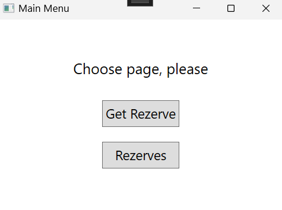
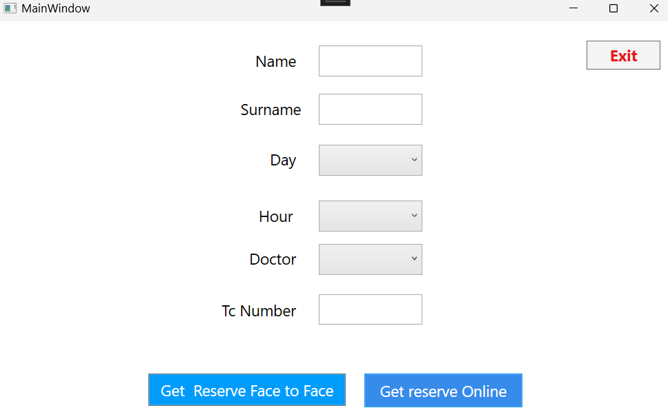
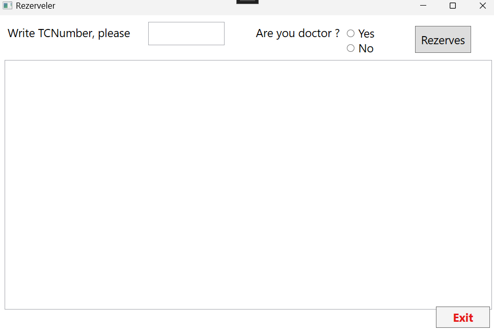

# 🏥 Hastane Randevu Sistemi - BMT110Project

Bu proje, C# ve WPF kullanılarak geliştirilmiş temel bir **hastane randevu sistemidir**. Kullanıcılar bir doktor ve gün/saat seçerek randevu oluşturabilir, doktorlar ise kendilerine gelen rezervasyonları görüntüleyebilir ve kabul/iptal edebilir.

---

## 🔧 Özellikler

- 👤 Kullanıcı ve doktor girişi (TC kimlik no ile)
- 📅 Gün ve saat seçerek randevu alma
- 🧑‍⚕️ Doktora göre filtrelenmiş rezervasyon listesi
- 🖥️ WPF tabanlı kullanıcı arayüzü
- 💾 SQLite veritabanı desteği (veya SQL Server)

---

## 📁 Proje Yapısı

```
BMT110Project/
├── Rezerve/                 # WPF uygulama kaynakları
│   ├── App.xaml             # Uygulama tanımı
│   ├── MainWindow.xaml      # Randevu alma arayüzü
│   ├── MainWindow.xaml.cs   # Randevu işlemleri
│   ├── Rezerves.xaml        # Rezervasyon listeleme arayüzü
│   ├── Rezerves.xaml.cs     # Doktor rezervasyon kontrolü
│   ├── RezerveModel.cs      # Veri modeli
│   └── App.config           # Veritabanı bağlantı ayarları
├── veritabani.db            # SQLite veritabanı (örnek)
├── Rezerve.sln              # Visual Studio çözüm dosyası
└── .gitignore               # Gereksiz dosyaları dışlama ayarları
```

---

## 🧪 Kullanılan Teknolojiler

- `C#` — Ana programlama dili
- `WPF` — Grafik kullanıcı arayüzü için
- `SQL Server` — Veritabanı altyapısı
- `XAML` — Arayüz tasarımı

---

## 🚀 Kurulum ve Çalıştırma

1. Visual Studio 2019+ ile projeyi aç.
2. `App.config` içindeki bağlantı cümlesini **yerel veritabanına göre** güncelle.
3. Gerekirse `doctors` ve `rezerves` tablolarını SQL ile oluştur:
   ```sql
   CREATE TABLE doctors (
       id INT PRIMARY KEY IDENTITY(1,1),
       name NVARCHAR(50),
       surname NVARCHAR(50),
       tc_number BIGINT UNIQUE
   );

   CREATE TABLE rezerves (
       id INT PRIMARY KEY IDENTITY(1,1),
       name NVARCHAR(50),
       surname NVARCHAR(50),
       day NVARCHAR(20),
       hour NVARCHAR(10),
       doctor NVARCHAR(50),
       id_user BIGINT,
       rezerve_type NVARCHAR(20)
   );
   ```
4. Projeyi derleyip çalıştır.

---

## 📷 Ekran Görüntüleri





---

## 👥 Katkıda Bulunanlar

- **21040001** - Ana geliştirici

---

## 📝 Lisans

Bu proje eğitim amaçlıdır ve açık kaynak olarak paylaşılmıştır.
